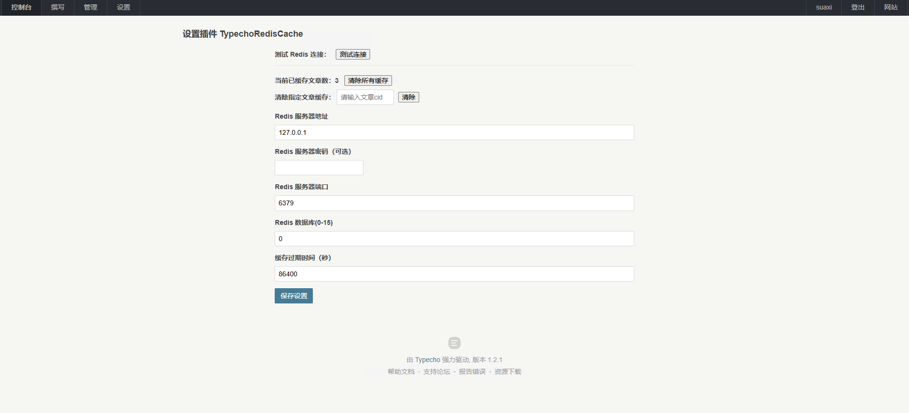

### Typecho Redis 文章缓存插件

#### 使用说明：

1. 安装 `php-redis`
2. `php.ini ` 开启 `redis` 扩展
3. 将插件上传至 `typecho/plugins` 插件目录，并在后台 - 插件管理 - 启用

#### 功能：

1. 文章缓存

#### 预览：

#### 开发计划：

- [x] ~~缓存可视化界面~~，请使用 RDM、RedisInsight 等工具类
- [x] 禁用插件时清除缓存
- [x] 已缓存文章数量统计
- [x] 清除所有缓存
- [x] 清除指定文章缓存
- [x] Redis 服务端连接配置优化
- [x] 添加可选密码配置**（注：生产环境建议隔离 `Redis` 外网权限，仅在内网使用）**